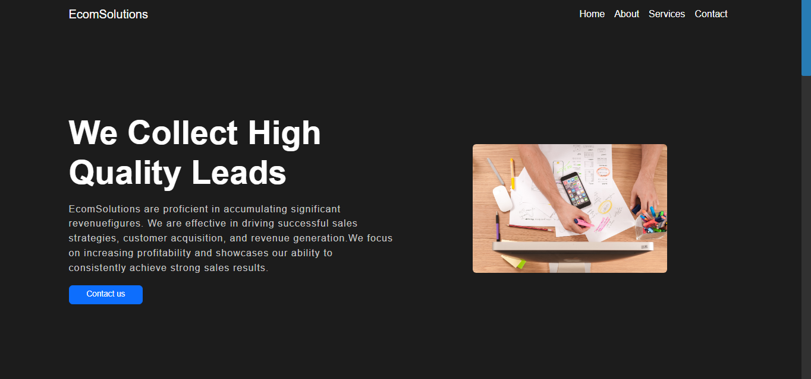

# Ecommerce Services Web

This is a simple website template for an Ecommerce Services website. It includes sections like a navbar, hero section, service section, contact us section, and about us section. The website is built using HTML and CSS and utilizes the Bootstrap framework for styling.

## Preview




## Table of Contents
- [Features](#features)
- [Usage](#usage)
- [Getting Started](#getting-started)
- [License](#license)

## Features
- Responsive design for various screen sizes.
- Easily customizable.
- Clean and well-structured code.
- Utilizes Bootstrap for styling.

## Usage
You can use this template as a starting point for your own Ecommerce Services website. Follow the steps below to get started.

## Getting Started
1. Clone this repository to your local machine:
   ```
   git clone https://github.com/MuhammadAmmarAtique/Ecommerce-Services-Web
   ```

2. Open the `index.html` file in your preferred code editor.

3. Customize the content, images, and styles according to your requirements.

4. Host your website on your preferred hosting platform.

5. That's it! Your Ecommerce Services website is ready.

## License
This project is licensed under the [MIT License](LICENSE).
